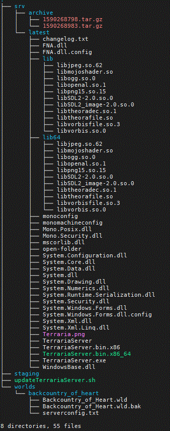

# Terraria

## Update Terraria Server
The script updateTerrariaServer.sh is used to pull and rotate terraria servers as new versions are released.

I do not know what the new versions are or what conventions might change so two values are kept at the top that are expected to be updated by the user before use.

As of v1.4.0.4 these values at the top of the script are accurate
    
    # !! Keep this version number updated !!
    VERSION=1404
    
    # !! Keep this url updated !!
    #TERRARIA_URL=''
    TERRARIA_URL='https://www.terraria.org/system/dedicated_servers/archives/000/000/038/original/terraria-server-1404.zip'

## Assumptions
On my server I save all terraria related files here, that I call TERRARIA_HOME
    
    /wd/terraria/

This is a secondary hard drive mounted on /wd 
I assume the user has full permission (rwx) for this directory, or whatever directory they use.
If changing to a different TERRARIA_HOME simply change the part of the script that looks like this

        TERRARIA_HOME='/wd/terraria'

## Script procedure
1. File and permission checking
1. Cleanup directories to help consistancy of each run
1. Pull server zip file provided by terraria.org
1. Unzip our new zip file, correct permissions
1. Create copy and archive a copy our now old server files
1. Perform archive file rotation (default 2)
1. Prompt user to check that the server is not currently running the game. We would not want to delete files that are currently executing. That might be a bummer.
    1. If user replys with not 'y' or 'Y', script terminates leaving it to the user to copy-paste the new files over.
 1. Remove all old server files in latest/ that are to be replaced
 1. Moves our new files that we staged into the latest/ directory
 1. Some cleanup
 
## Directory Tree

## Terraria official documentation
https://terraria.gamepedia.com/Server
